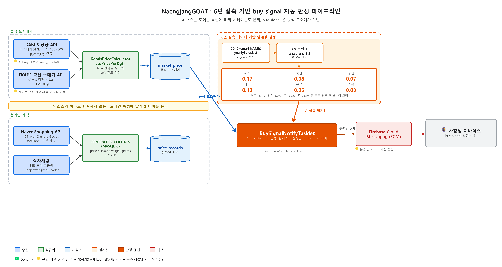

# 냉장GOAT — 자영업자 발주 의사결정 지원 백엔드

자영업 식자재 발주 결정을 코드로 지원하는 Spring Boot 3.5 / Java 21 백엔드.
4개 외부 가격 소스를 통합하고, 6년 실측 데이터로 도출한 임계값으로 buy-signal을 자동 판정한다.

🇬🇧 [README.en.md](README.en.md) · 📜 v1 보존본: [README_0315.md](README_0315.md)

---

## 프로젝트 요약

| 항목 | 내용 |
|---|---|
| 기간 | 2025.10 ~ 진행 중 (캡스톤 팀 프로젝트) |
| 역할 | 백엔드 리드 (sim 팀원 1명 협업) |
| 스택 | Spring Boot 3.5 · Java 21 · MySQL 8 · Redis · Spring Batch · Flyway · Resilience4j · FCM |
| 검증 완료 | 4종 락 전략 비교 (500-스레드 카오스) · 4-소스 가격 통합 · KAMIS 6년 buy-signal threshold |
| 현재 상태 | 동시성 · 가격 통합 · 발주 이력 CRUD 구현 완료 / UC-CORE-3 발주 시점 예측 미구현 |



---

## 배경

식자재 B2B 시장은 KFDA 추정 2023년 62조 원 규모로 연 평균 약 4.7% 성장 중이다.
그러나 송탄점·용인 막창점 사장님 인터뷰 결과, 여전히 거래처 5곳에 SMS로 개별 발주, 월 3~6건 단가 오류, 주당 3~5시간을 재고 확인에 소비하고 있었다.

현장에서 확인한 세 가지 문제:

1. **재고 파악의 피로도** — 손글씨 재고 확인, 실시간 파악 불가
2. **감으로 하는 원가 추정** — 발주 단가 비교 수단 없음
3. **발주 시점을 놓침** — 가격이 저렴할 때를 인지하지 못함

발주고·식자재왕·오늘얼마 등 기존 앱은 각자 강점이 있으나, 재고 추정 + 발주 타이밍 알림 + 시장 평균가 비교 세 가지를 동시에 제공하는 서비스는 없다.

이 프로젝트의 목표: 소진 예측과 최저가를 동시에 감지해 발주 의사결정을 자동화하는 것.
현재는 가격 통합·buy-signal 판정까지 구현. 발주 시점 자동 알림(UC-CORE-3)은 미구현.

---

## v0 → v2 피봇 — "엔진은 람보르기니인데 운전석이 없다"

v0은 동시성 락 전략 데모였다. 2026-04-05 plan.md에서 자기 비판이 들어갔다.

> *사장님은 데이터 정합성이 아니라 걱정과 수고를 덜어주는 대가로 월 3만원을 낸다.*

이후 모든 기능은 **발주 의사결정 지원** 하나에 정렬됐다.

---

## 발주 의사결정 3축 vs 현재 코드 상태

| 축 | 유스케이스 | 상태 | 코드 진실 |
|---|---|:---:|---|
| 우선순위 | UC-CORE-1: 재고 임박 Top 5 | 🟡 | FIFO 쿼리 있음. 전용 API · 소진 예상일 없음 |
| 가격 | UC-CORE-2: 최저가 Top 5 | 🟡 | `pricing/` 17파일 빌드 통과, 통합 테스트 0건 |
| 타이밍 | UC-CORE-3: 발주 시점 예측 · 알림 | ❌ | `/orders/forecast` · 예측 로직 코드 0줄 |
| 이력 | UC-SUP-8: 발주 이력 CRUD | ✅ | create/list/summary + Excel export 구현 완료 |

UC-CORE-3 미구현이므로 "발주 시간 절감" · "30분 절약" 표현은 이 저장소 어디에도 없다.

---

## 핵심 측정 결과

### 4종 락 비교 — 500-스레드, 초기 재고 100g, 1g/요청

| 전략 | 잔여 재고 | 정합성 | 비고 |
|---|:---:|:---:|---|
| NONE (control) | **10g** | ❌ | Lost Update fingerprint — 회귀 ground truth로 의도적 보존 |
| SPIN (Redis SETNX) | 0g | ✅ | TTL 30s, polling 1ms |
| REDISSON + CB | 0g | ✅ | tryLock(5s wait, 10s lease), **1순위** |
| PESSIMISTIC | 0g | ✅ | REDISSON 장애 시 CB 자동 fallback |

NONE 잔여 10g: MySQL REPEATABLE READ의 Last-Writer-Wins 실측 fingerprint.
"항상 통과하는 테스트는 ground truth를 잃은 테스트"라는 판단으로 NONE을 코드베이스에 보존했다.

ChaosTest (`docker stop redis-test`): CB (slidingWindow=10, failureRate=50%) 3회 실패 후 PESSIMISTIC 자동 전환 확인.

### KAMIS 6년 buy-signal threshold (2019~2024, z-score ≤ 1.3 이상치 제거)

| 카테고리 | 분석 품목 및 CV | Threshold |
|---|---|:---:|
| 채소 | 배추 16.1% · 양파 5.0% · 무 16.8% · 파 28.4% → avg 16.6% | **0.17** |
| 축산 | EKAPE 소비자가격 4품목 avg 4.9%, B2B 보수적 상향 | **0.08** |
| 수산 | 고등어 7.7% · 명태 5.6% → avg 6.7% | **0.07** |
| 과일 | 배 12.3% · 사과후지 12.9% → avg 12.6% | **0.13** |
| 곡물 | 쌀 4.5% | **0.05** |
| 가공 | 변동 낮음, 별도 분석 없이 고정 | **0.03** |

buy-signal 조건: `currentPricePerKg < monthAvg × (1 − threshold)`

실 검증: 배추 2026-05-03~10 buySignal=true. 도매가 15,725원/kg, 30일 평균 20,698 대비 24.0% 하락.

---

## 아키텍처

```
[4-소스 가격 수집 + 2-테이블 분리]
  KAMIS (도매시장 XML)  ─┐
  EKAPE (축산 HTML)     ─┴─▶ market_price   ← KamisPriceCalculator Java 런타임 정규화 (원/kg)

  Naver Shopping API   ─┐
  식자재왕 B2B 크롤링   ─┴─▶ price_records  ← GENERATED ALWAYS AS (price×1000/weight_grams) STORED

[Spring Batch 파이프라인]
  kamisPriceStep (chunk=50)
    KamisApiReader → KamisPriceProcessor → KamisPriceWriter
        ↓
  buySignalNotifyStep (tasklet)
    BuySignalNotifyTasklet → 사용자별 집계 → FCM 알림

[동시성 제어]
  REDISSON (1순위)  ──▶  CircuitBreaker  ──▶  PESSIMISTIC (fallback)
```

시각 자료 보강 예정:
- [ ] Spring Batch 파이프라인 흐름도 (이미지)
- [ ] 4종 락 비교 차트 (500-스레드 결과)
- [ ] KAMIS 6년 변동성 그래프 (카테고리별 CV)
- [ ] 2-테이블 분리 구조 다이어그램

상세 ADR: [`MD/ADR-001-lock-strategy.md`](MD/ADR-001-lock-strategy.md) · [`MD/ADR-002-generated-column.md`](MD/ADR-002-generated-column.md) *(작성 예정)*

---

## 구현 완료

- ✅ 동시성 제어 — 4종 락 전략 + Circuit Breaker fallback (REDISSON 1순위, PESSIMISTIC fallback)
- ✅ 가격 통합 — 4-소스 · 2-테이블 분리 · GENERATED COLUMN 단위 정규화
- ✅ buy-signal — KAMIS 6년 실측 threshold · BuySignalNotifyTasklet · FCM 알림
- ✅ 발주 이력 — UC-SUP-8 CRUD (create/list/summary) + Excel export
- ✅ 인증 — JWT (Access 1h / Refresh 7d) · Spring Security
- ✅ 온보딩 API · 재고 단건 입력 · 배치 admin endpoint · Flyway V001~V008

---

## 설계 완료 / 진행 중

- 🟡 UC-CORE-2 최저가 Top 5 — `pricing/` 빌드 통과, 통합 테스트 미작성
- 🟡 UC-CORE-1 재고 Top 5 — FIFO 쿼리 있음, 전용 API · 소진 예상일 미완
- 🟡 KAMIS item_code 매핑 — V007 컬럼 추가 완료, 초기 매핑 데이터 미입력

---

## 로드맵

- [ ] UC-CORE-3: 발주 시점 예측 + 알림 (`OrderForecastScheduler`, `GET /orders/forecast`)
- [ ] UC-CORE-1 완성: 재고 Top 5 endpoint + 등급 색상 + 소진 예상일
- [ ] UC-CORE-2 통합 테스트 보강
- [ ] sim 크롤러 데이터 dev DB 적재 검증
- [ ] Firebase 서비스 계정 JSON 발급 → FCM 실 발송 활성화
- [ ] ADR 문서 작성 (MD/ADR-001, ADR-002)

---

## 기술 스택

| 영역 | 기술 |
|---|---|
| 언어 | Java 21 |
| 프레임워크 | Spring Boot 3.5.7 · Spring Batch · Spring Security · Spring Data JPA |
| DB | MySQL 8.0+ (GENERATED COLUMN STORED) |
| 마이그레이션 | Flyway V001~V008 |
| 캐시 · 분산 락 | Redis 7 · Redisson 3.23.2 |
| 신뢰성 | Resilience4j 2.1.0 (CircuitBreaker) |
| 알림 | Firebase Cloud Messaging (FCM) |
| 테스트 | JUnit 5 · CountDownLatch |
| 외부 API | KAMIS (XML) · EKAPE · Naver Shopping API (JSON) |
| 크롤러 (sim) | Python 3 · Selenium · webdriver-manager |

---

## 역할 및 담당

| 영역 | 박건우 | sim |
|---|---|---|
| 도메인 설계 | 발주 의사결정 3축 정의 · 피봇 결정 | |
| 동시성 | 4종 락 + CB 구현 · 500-스레드 카오스 테스트 | |
| 가격 통합 | `pricing/` 모듈 · EKAPE 통합 · 6년 threshold · GENERATED COLUMN 합의 | |
| 발주 이력 | UC-SUP-8 CRUD + Excel export | |
| 알림 | FCM 인프라 · BuySignalNotifyTasklet | |
| 외부 크롤러 | | 식자재왕 Python 크롤러 · 레시피 템플릿 |

---

## 로컬 실행

```bash
# 1. MySQL 스키마 생성
mysql -u root -p -e "CREATE DATABASE naengjang_goat_db;"

# 2. 환경변수 설정 (application.properties 참조)
export SPRING_DATASOURCE_URL=jdbc:mysql://localhost:3306/naengjang_goat_db
export KAMIS_CERT_KEY=<your-key>

# 3. 실행 (Flyway 자동 적용 V001~V008)
./gradlew bootRun
```

데모 계정: `username=demo / password=demo1234` (DataInitializer 자동 생성)

JWT 취득:
```
POST /api/users/login
{ "username": "demo", "password": "demo1234" }
```

---

## 참고 문서

- `MD/plan_park_*` — 의사결정 흐름 (v0.3 → v0.4 피봇, sim 합의 회신)
- `MD/ADR-001-lock-strategy.md` — 4종 락 전략 선택 근거 (상세) *(작성 예정)*
- `MD/ADR-002-generated-column.md` — GENERATED COLUMN 결정 근거 (상세) *(작성 예정)*
- `src/main/resources/db/migration/` — Flyway V001~V008
- [README.en.md](README.en.md) · [README_0315.md](README_0315.md)

---

## 연락처

**박건우 | Backend Engineer**

- 이메일: gunwoo363@gmail.com
- GitHub: [github.com/gm-15](https://github.com/gm-15)
- Blog: [velog.io/@gm-15](https://velog.io/@gm-15)
